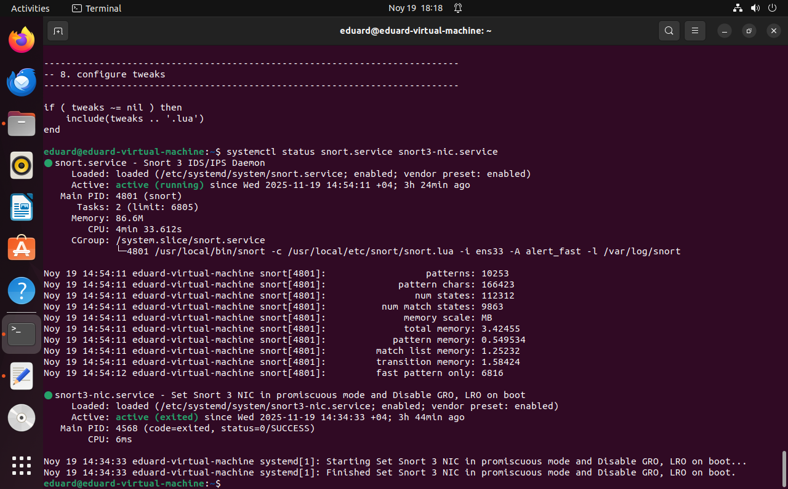
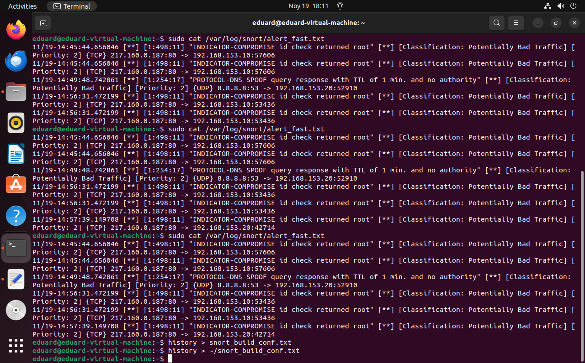

# Snort 3 Deployment on Ubuntu 22.04

This repository documents a full installation and configuration of the **Snort 3** network intrusion detection system (NIDS) on an Ubuntu 22.04 host.  It contains clean configuration files, systemd unit files and illustrative screenshots that were produced while testing the installation.  The steps outlined here are intended for a lab or portfolio environment and can easily be adapted to other Debian‑based distributions.

> **Note**
>
> All commands below should be executed as a user with root privileges (either by prefixing with `sudo` or by running in a root shell).  Replace `ens33` and IP addresses with the names and addresses appropriate for your environment.

## Contents

| Path                           | Description                                            |
|--------------------------------|--------------------------------------------------------|
| `config/snort.lua`             | Main Snort 3 configuration file with sane defaults and customisation for the local network. |
| `services/snort3-nic.service`  | systemd unit used to put the monitoring interface into promiscuous mode and disable hardware offloading features. |
| `services/snort.service`       | systemd unit for running Snort 3 as a daemon using the above configuration. |
| `images/alert_fast1.png`       | Terminal screenshot showing generated alerts. |
| `images/alert_fast2.png`       | Another alert screenshot with additional commands. |
| `images/centos_ip.png`         | `ip a` output from a second machine used for testing. |
| `images/service_status.png`    | systemd status output confirming the services are active. |

## Documentation

If you prefer more granular instructions, detailed guides covering installation, configuration, service management and testing are provided in the [docs](docs/) folder.  The index in `docs/README.md` lists all available guides.

## Prerequisites

Before building Snort you must update the system package list and install the build toolchain and libraries.  On a freshly installed Ubuntu 22.04 host run:

```bash
apt update && apt dist-upgrade -y

# install the required development libraries
apt install -y build-essential libpcap-dev libpcre3-dev libnet1-dev \
    zlib1g-dev luajit hwloc libdnet-dev libdumbnet-dev bison flex liblzma-dev \
    openssl libssl-dev pkg-config libhwloc-dev cmake cpputest libsqlite3-dev \
    uuid-dev libcmocka-dev libnetfilter-queue-dev libmnl-dev autotools-dev \
    libluajit-5.1-dev libunwind-dev libfl-dev
```

### Optional: gperftools

For higher throughput on multi‑core systems you can optionally build the [thread‑caching malloc](https://github.com/gperftools/gperftools) library.  Snort will use this allocator when built with the `--enable-tcmalloc` switch.

```bash
cd ~/snort_src
wget https://github.com/gperftools/gperftools/releases/download/gperftools-2.9.1/gperftools-2.9.1.tar.gz
tar xzf gperftools-2.9.1.tar.gz
cd gperftools-2.9.1
./configure
make
make install
```

### Compile and install the DAQ library

Snort 3 relies on the Data Acquisition (DAQ) library for packet capture.  It is built from source as follows:

```bash
cd ~/snort_src
git clone https://github.com/snort3/libdaq.git
cd libdaq
./bootstrap
./configure
make
make install
```

## Building and installing Snort 3

Snort 3 is not currently packaged in the Ubuntu 22.04 repositories, so it must be built from source.  The following commands fetch the latest code and install it into `/usr/local`:

```bash
cd ~/snort_src
wget https://github.com/snort3/snort3/archive/refs/heads/master.zip -O snort3.zip
unzip snort3.zip
cd snort3-master
./configure_cmake.sh --prefix=/usr/local --enable-tcmalloc
cd build
make
make install

# update the dynamic linker cache
ldconfig

# verify the installation
snort -V
```

If the version prints successfully, Snort is now installed under `/usr/local/bin/snort` and the Lua configuration skeleton is located in `/usr/local/etc/snort`.

## Initial configuration

1. **Set the monitored network**:  Edit `config/snort.lua` and set `HOME_NET` to the CIDR range you wish to protect (e.g. `"192.168.153.0/24"`).  The `EXTERNAL_NET` variable is defined as anything outside this range.

2. **Symlink default variables**:  If the `snort_defaults_pkg.lua` file exists in `/usr/local/etc/snort`, create a symbolic link so that Snort can locate it:

   ```bash
   cd /usr/local/etc/snort
   ln -s snort_defaults.lua snort_defaults_pkg.lua
   ```

3. **Create directories and rule files**:  Snort expects directories for rules, lists and logs.  Create them and a sample `local.rules` file:

   ```bash
   mkdir -p /usr/local/etc/rules /usr/local/etc/so_rules /usr/local/etc/lists
   touch /usr/local/etc/rules/local.rules
   touch /usr/local/etc/lists/default.blocklist
   mkdir -p /var/log/snort
   chown -R snort:snort /var/log/snort
   chmod -R 5775 /var/log/snort
   ```

   A simple test rule that detects ICMP echo traffic can be added to `local.rules`:

   ```
   alert icmp any any -> any any ( msg:"ICMP traffic detected"; sid:10000001; metadata:policy security-ips alert; )
   ```

4. **Modify the Snort Lua configuration**:  See `config/snort.lua` for a cleaned up example configuration.  It loads the community ruleset and the local rule file, enables the `alert_fast` output and runs in `tap` mode (IDS).  Adjust modules and outputs as needed.

## Creating systemd unit files

Two systemd units are used: one to tune the interface for packet capture and one to run Snort as a service.

### `snort3-nic.service`

This one‑shot service puts the interface into promiscuous mode and disables large receive offload (GRO/LRO).  It should run once at boot before Snort starts.

```ini
[Unit]
Description=Set Snort 3 NIC in promiscuous mode and disable GRO, LRO on boot
After=network.target

[Service]
Type=oneshot
ExecStart=/usr/sbin/ip link set dev ens33 promisc on
ExecStart=/usr/sbin/ethtool -K ens33 gro off lro off
TimeoutStartSec=0
RemainAfterExit=yes

[Install]
WantedBy=default.target
```

Copy this file to `/etc/systemd/system/` and enable it:

```bash
cp services/snort3-nic.service /etc/systemd/system/
systemctl daemon-reload
systemctl enable --now snort3-nic.service
```

### `snort.service`

This unit runs Snort as a daemon.  It references the Lua configuration and writes alerts to `/var/log/snort`.  The example below runs Snort on interface `ens33` in fast‑alert mode and automatically restarts on failure.

```ini
[Unit]
Description=Snort 3 IDS/IPS Daemon
After=network.target snort3-nic.service

[Service]
Type=simple
ExecStart=/usr/local/bin/snort \ 
  -c /usr/local/etc/snort/snort.lua \ 
  -i ens33 \ 
  -A alert_fast \ 
  -s 65535 \ 
  -k none \ 
  -l /var/log/snort \ 
  -D \ 
  -u snort \ 
  -g snort \ 
  --create-pidfile
Restart=always

[Install]
WantedBy=multi-user.target
```

Install and enable this service:

```bash
cp services/snort.service /etc/systemd/system/
systemctl daemon-reload
systemctl enable --now snort.service
```

After enabling the services you can verify their status:

```bash
systemctl status snort3-nic.service
systemctl status snort.service
```

An example of the service status output is shown below:



## Testing the deployment

With Snort running, generate test traffic from another host on the same network.  A popular test is to fetch <https://testmyids.com>, which returns a page designed to trigger IDS signatures.  On the remote host run:

```bash
curl http://testmyids.com
```

Snort should generate alerts in `/var/log/snort/alert_fast.txt`.  You can watch the log live with `tail -f` or examine it after the fact.  Example alert output is shown below:



## Build history (summary)

The following concise summary outlines the sequence of commands executed during the original build.  Duplicate commands, trial‑and‑error edits and unrelated tasks have been removed for clarity.

1. **Download and install Snort dependencies**: `apt update`, `apt install` for development libraries and build tools (see [Prerequisites](#prerequisites)).
2. **Clone and build DAQ**: `git clone https://github.com/snort3/libdaq.git`, `./bootstrap && ./configure && make && make install`.
3. **Download and build Snort3**: fetch the source from GitHub, run `./configure_cmake.sh --prefix=/usr/local --enable-tcmalloc`, then `make && make install`.
4. **Link default configuration**: navigate to `/usr/local/etc/snort` and create `snort_defaults_pkg.lua` as a symlink to `snort_defaults.lua`.
5. **Create required directories**: `mkdir -p /usr/local/etc/rules`, `touch /usr/local/etc/rules/local.rules`, `mkdir -p /var/log/snort` and fix permissions.
6. **Modify `snort.lua`**: set `HOME_NET`, include rule files and enable `alert_fast` output.
7. **Write a test rule** in `local.rules` to verify that Snort triggers alerts.
8. **Create systemd unit files**: `snort3-nic.service` to put the interface in promiscuous mode and `snort.service` to run Snort with the desired options.  Enable both services with `systemctl enable --now`.
9. **Test** by generating traffic from another machine (e.g. using `curl testmyids.com`) and confirm that alerts appear in the log.

## Conclusion

This repository offers a clean, reproducible example of deploying Snort 3 as an intrusion detection sensor on Ubuntu 22.04.  The configuration files provided here can serve as a starting point for more advanced setups.  Adjust the variables and rules to suit your environment, and always keep your rulesets up‑to‑date.