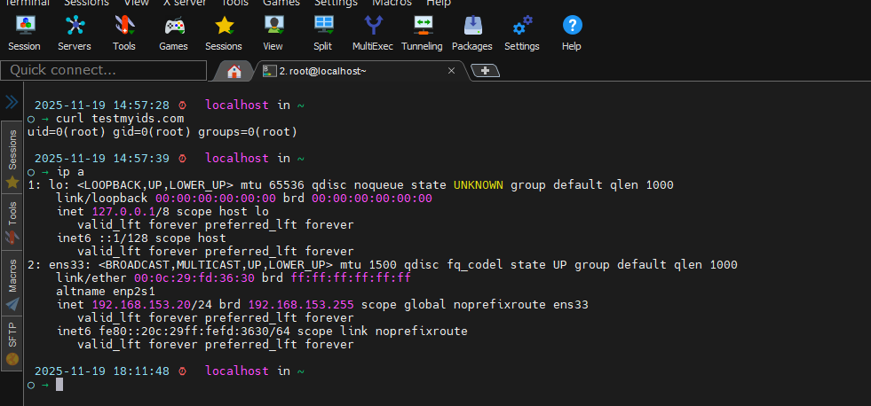
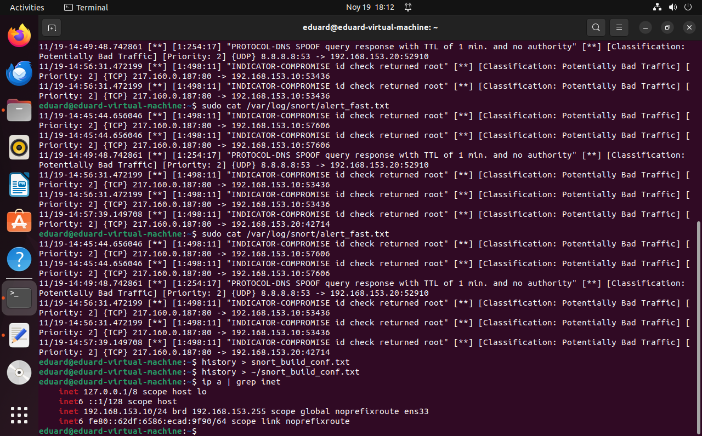

# Testing Snort and Analyzing Alerts

After building and configuring Snort, you should verify that it processes traffic and generates alerts.  This guide demonstrates how to confirm that both the sensor and a test host are on the same network, trigger signatures and interpret the resulting alert log.

## 1. Verify network connectivity

Use a second machine on the same subnet to generate traffic.  You can check its IP address and interface configuration with:

```bash
ip a
```

Ensure that the remote host’s IP falls within your `HOME_NET` (e.g., `192.168.153.0/24`).  The screenshot below shows the output of `ip a` on a CentOS test machine with address `192.168.153.20`:



The Snort sensor should be connected to the same network segment and run on the monitoring interface configured in `snort.service`.

## 2. Generate test traffic

To trigger the example ICMP rule defined in `local.rules`, simply ping the Snort sensor from the test host.  For a richer set of alerts, visit a site designed to trigger IDS signatures, such as **testmyids.com**:

```bash
curl http://testmyids.com
```

This command fetches a page that includes patterns matched by several IDS signatures.

## 3. Monitor the alert log

Snort writes alerts to `/var/log/snort/alert_fast.txt` when configured with the `alert_fast` output plugin.  Use `tail -f` to watch the log in real time:

```bash
sudo tail -f /var/log/snort/alert_fast.txt
```

If the ICMP or HTTP tests succeed, you will see lines like the following:

```text
11/19-14:49:48.742681  [**] [1:254:17] "PROTOCOL-DNS SPOOF query response with TTL of 1 min. and no authority" [**] [Classification: Potentially Bad Traffic] [Priority: 2] {UDP} 8.8.8.8:53 -> 192.168.153.20:52910
11/19-14:56:31.472199  [**] [1:4988:11] "INDICATOR-COMPROMISE id check returned root" [**] [Classification: Potentially Bad Traffic] [Priority: 2] {TCP} 217.160.0.187:80 -> 192.168.153.20:57606
```

These entries indicate the signature ID (`[1:254:17]`), a description, the classification and priority, the protocol and the source/destination IPs and ports.  The first line shows Snort detecting a DNS spoof response with a low TTL, while the second line reports an HTTP response from `217.160.0.187` that contains a pattern often associated with compromised hosts.

The following screenshots capture parts of the alert log while running the test:




These alerts confirm that Snort is properly capturing traffic and matching signatures.  As you expand your rule sets, you will see different classifications and priorities reflecting the severity of the detected traffic.

## 4. Troubleshooting tips

- If no alerts appear, ensure that the monitoring interface is in promiscuous mode and that offloads are disabled (`snort3-nic.service`).
- Verify that the Snort process is running (`systemctl status snort.service`) and that it is bound to the correct interface.
- Make sure `HOME_NET` and `EXTERNAL_NET` in `snort.lua` are set correctly; if the test host is considered external, some local rules may not fire.
- Check file permissions on `/var/log/snort` to ensure Snort can write alerts.

By following these steps you can validate your Snort installation and begin building more complex rule sets and response strategies.
